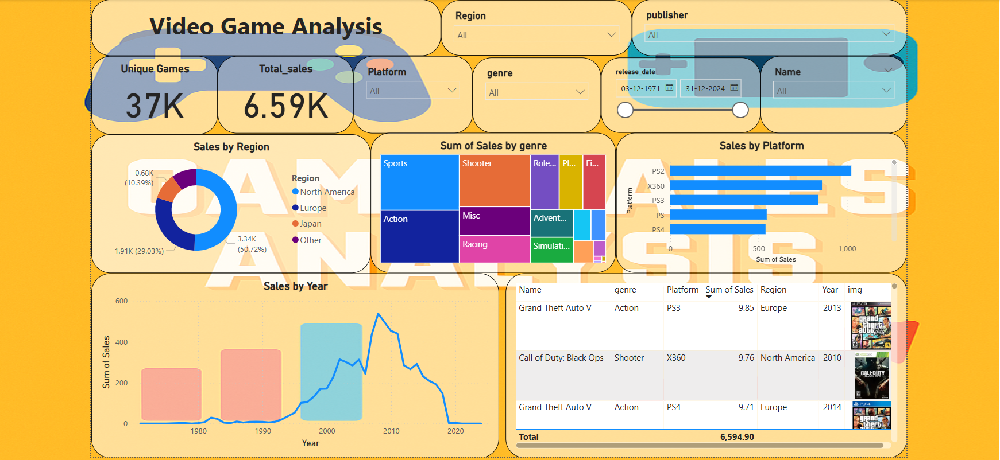

# 🎮 Video Game Sales Analysis Dashboard

This project explores and visualizes global video game sales data across **platforms**, **genres**, and **regions** using Power BI and Python.

 <!-- Optional: Replace with your actual image path -->

---

## 📌 Project Overview

- **Objective**: Analyze and visualize video game sales trends by region, genre, and platform.
- **Data Source**: [Kaggle - Video Game Sales Analyze Dataset](vgchartz-2024.csv)
- **Tools Used**:
  - Python (pandas, numpy)
  - Power BI
  - SQL (for insights and queries)

---

## 📁 Dataset Features

| Column Name   | Description                        |
|---------------|------------------------------------|
| `name`        | Game Title                         |
| `platform`    | Console/Platform (e.g. PS4, X360)  |
| `genre`       | Game Genre (e.g. Action, Sports)   |
| `publisher`   | Publishing Company                 |
| `developer`   | Game Developer                     |
| `release_date`| Date of Release                    |
| `total_sales` | Global Sales (millions)            |
| `na_sales`    | North America Sales                |
| `eu_sales`    | Europe Sales                       |
| `jp_sales`    | Japan Sales                        |
| `other_sales` | Other Regions Sales                |
| `img`         | Cover image URL                    |

---

## 🧹 Data Cleaning (Python)

- Removed unused columns 
- Cleaned and normalized genre/region names
- Handled missing/null values
- Added complete image URLs (`img` = `https://www.vgchartz.com/` + img)

---

## 📊 Power BI Dashboard Features

- 📍 **Sales by Region** –  pie chart of regional trends  
- 🎮 **Sales by Genre/Platform/Region/Publisher/Name** – Filterable insights with slicers  
- 📈 **Line Chart** – Sales by Region  
- 🖼️ **Game Image Visuals** – Game cover art with hover tooltips  
- 🧮 **Cards** – Total sales, total unique games  

---

## 💡 Key Insights

- Top-selling genres vary by region (e.g., RPGs dominate in Japan)
- Platforms like PS2 and X360 lead global sales
- Action and Sports remain the most profitable genres

---

## 🔗 Connect with Me

📧 Email: zarddinesh@gmail.com  
🔗 [LinkedIn](https://www.linkedin.com/in/zarddinesh)  
💻 [GitHub Portfolio][https://dineshzard.github.io/Dineshsharma.github.io/]

